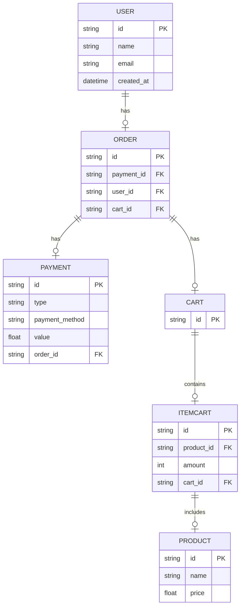

endpoints:
get user/id/orders

post order
get order/id
delete order/id
get order/id/info
get order/id/payment
get order/id/cart
get order/id/user

post payment
get payment/id

post product/
get product/
get product/id
put product/id
delete product/id

post cart
get cart/id/items (items-cart)

post item-cart/
get item-cart/id
put item-cart/id
delete item-cart/id